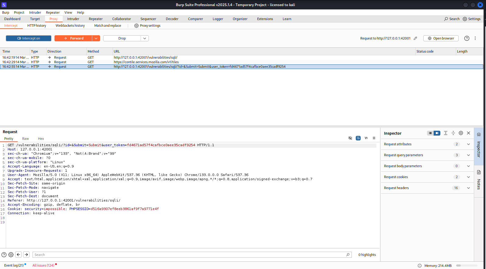
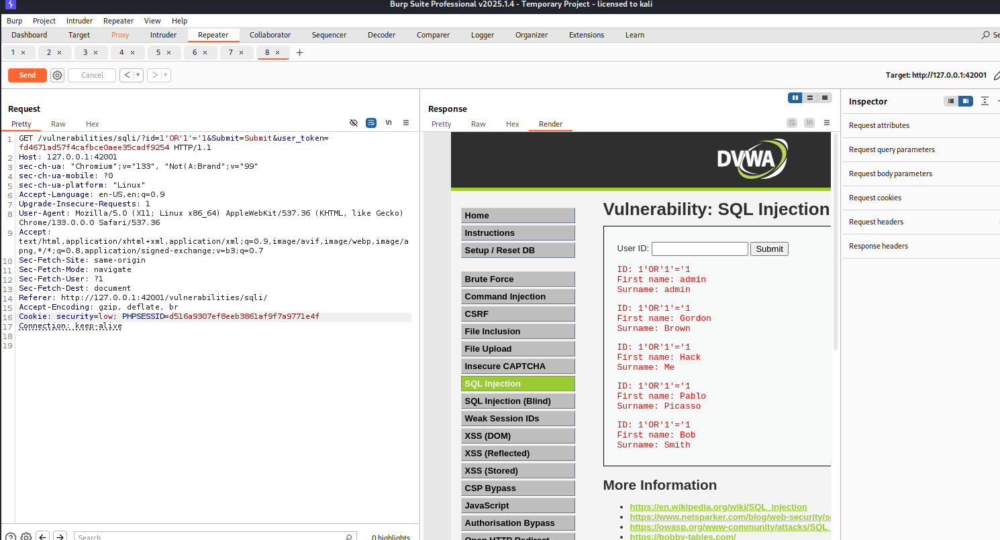

# 🔍 Burp Suite Lab — HTTP Interception & SQL Injection via Repeater
**Author:** Nivedhitha K.S  
**Date:** March 2026  
**Tool:** Burp Suite Professional v2025.1.4  
**Target:** DVWA (Damn Vulnerable Web Application) on Kali Linux  
**Category:** Web Application Security | Penetration Testing Methodology

---

## 📋 Overview

This report documents hands-on use of Burp Suite — the industry-standard web application penetration testing tool. Two core techniques are demonstrated: HTTP request interception using Burp Proxy, and manual SQL injection attack delivery using Burp Repeater — all performed in a controlled, legal lab environment.

---

## 🛠️ What is Burp Suite?

Burp Suite is a web application security testing platform used by penetration testers worldwide. It sits as a **proxy between the browser and the server**, allowing the tester to:

- **Intercept** every HTTP/HTTPS request and response
- **Modify** requests before they reach the server
- **Replay** requests with different parameters using Repeater
- **Automate** attacks using Intruder
- **Scan** for vulnerabilities automatically (Pro version)

| Component | Purpose |
|-----------|---------|
| Proxy | Intercept and view all traffic |
| Repeater | Manually modify and resend requests |
| Intruder | Automate attacks (brute force, fuzzing) |
| Scanner | Automatic vulnerability detection |
| Decoder | Encode/decode data (Base64, URL, etc.) |

---

## 🧪 Lab 1 — HTTP Request Interception

### What Happened
Burp Suite was configured as a proxy for the Burp browser. When the DVWA SQL Injection page was accessed, Burp intercepted every HTTP request in real time — **before it reached the server**.

### Screenshot — Burp Proxy Intercepting Live Traffic



### What You Can See
The intercepted raw HTTP request reveals:

```
GET /vulnerabilities/sqli/?id=&Submit=Submit HTTP/1.1
Host: 127.0.0.1:42001
User-Agent: Mozilla/5.0 (X11; Linux x86_64) Chrome/133.0.0.0
Cookie: security=impossible; PHPSESSID=d516a9307ef8eeb3861af9f7a9771e4f
```

**Key security observations from this single intercepted request:**

| Header/Field | Security Relevance |
|-------------|-------------------|
| `Cookie: security=impossible` | Security level is controlled by a cookie — easily manipulated! |
| `PHPSESSID=d516a...` | Session token visible — if stolen, attacker owns this session |
| `user_token=fd4671...` | CSRF token present in URL — exposed in server logs |
| `User-Agent` | Browser fingerprint visible to server |

**Critical finding:** The security level is stored in a **client-side cookie** (`security=impossible`). This means any user can change it to `security=low` by simply editing the cookie in Burp — bypassing the intended protection entirely.

---

## 🧪 Lab 2 — SQL Injection via Burp Repeater

### What is Repeater?
Repeater allows a pentester to take any intercepted request, **modify it**, and send it directly to the server — without using a browser at all. This is how professionals test for vulnerabilities efficiently.

### Attack Steps

**Step 1 — Intercepted the SQL injection page request**

**Step 2 — Sent to Repeater**
Right-clicked the intercepted request → Send to Repeater

**Step 3 — Modified the request:**

Changed the URL parameter from:
```
id=1
```
To the SQL injection payload:
```
id=1'OR'1'='1
```

**Step 4 — Modified the Cookie:**

Changed:
```
Cookie: security=impossible
```
To:
```
Cookie: security=low
```

**Step 5 — Clicked Send**

### Screenshot — SQL Injection Executed via Repeater



### Result — All 5 Users Extracted

The response panel (right side) shows the full database dump:

```
ID: 1'OR'1'='1  →  First name: admin   | Surname: admin
ID: 1'OR'1'='1  →  First name: Gordon  | Surname: Brown
ID: 1'OR'1'='1  →  First name: Hack    | Surname: Me
ID: 1'OR'1'='1  →  First name: Pablo   | Surname: Picasso
ID: 1'OR'1'='1  →  First name: Bob     | Surname: Smith
```

**This entire attack was performed inside Burp Repeater — the browser was never touched.**

---

## 🔑 Why Burp Repeater is Powerful

| Without Burp | With Burp Repeater |
|-------------|-------------------|
| Type payload in browser form | Modify raw HTTP request directly |
| One attempt at a time | Send hundreds of variations instantly |
| Browser encodes special characters | Full control over exact bytes sent |
| Can't modify cookies/headers | Modify ANY part of the request |
| No response history | Full history of every request/response |

---

## 💡 Key Security Findings from This Lab

### Finding 1 — Security Level Controlled by Client Cookie
**Severity: HIGH**

The application stores its security level in a cookie (`security=low/medium/high/impossible`). Since cookies are client-side, any user can modify them using Burp to downgrade security to `low` — completely bypassing the intended protection.

**Fix:** Security levels should be stored **server-side** in the session, not in a client-accessible cookie.

### Finding 2 — SQL Injection in User ID Parameter
**Severity: CRITICAL**

The `id` parameter in `/vulnerabilities/sqli/` is directly concatenated into a SQL query without sanitization. Injecting `1'OR'1'='1` returns all database records.

**Fix:** Use parameterized queries / prepared statements.

### Finding 3 — Session Token Exposed in URL
**Severity: MEDIUM**

The `user_token` CSRF token appears in the GET request URL. URL parameters are logged in server logs, browser history, and proxy logs — exposing the token.

**Fix:** CSRF tokens should be in POST body or request headers, never in GET URLs.

---

## 🛡️ How Burp Suite is Used in Real Pentests

```
Phase 1: Reconnaissance
└── Browse target with Burp proxy ON
└── Build site map in Target tab
└── Identify all parameters and entry points

Phase 2: Manual Testing
└── Use Repeater to test each parameter
└── Try SQL injection, XSS, IDOR payloads
└── Modify cookies, headers, tokens

Phase 3: Automated Testing
└── Send to Intruder for brute force
└── Run active scanner (Pro version)
└── Identify patterns across endpoints

Phase 4: Reporting
└── Document all findings with screenshots
└── Assign severity ratings
└── Provide remediation guidance
```

---

## 📚 Key Learnings

1. **Burp Proxy sits between browser and server** — everything passes through it
2. **Cookies are client-side** — never store security-critical data in cookies
3. **Repeater enables precise attack delivery** — full control over every byte
4. **Raw HTTP requests reveal more than browsers show** — headers, tokens, cookies
5. **Security levels in cookies can be bypassed** — always enforce server-side
6. **Burp is the #1 tool in every professional pentester's toolkit** — essential to learn

---

## 🔗 References

- [PortSwigger Burp Suite Documentation](https://portswigger.net/burp/documentation)
- [PortSwigger Web Security Academy](https://portswigger.net/web-security)
- [OWASP Testing Guide](https://owasp.org/www-project-web-security-testing-guide/)

---

*Part of my 60-day cybersecurity learning journey — Day 10.*  
*GitHub: [NivedhithaKS-SEC](https://github.com/NivedhithaKS-SEC/cybersec-journey)*  
*TryHackMe: [NivedhithaKS](https://tryhackme.com/p/NivedhithaKS)*
