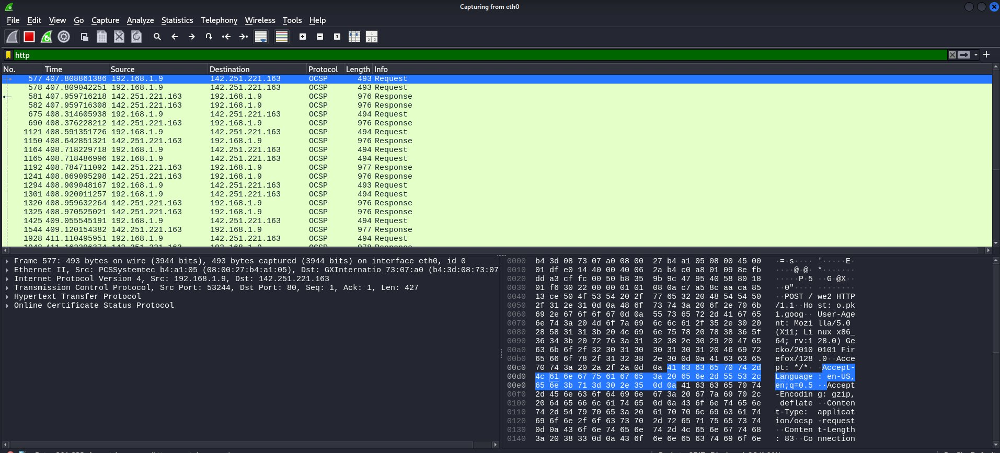
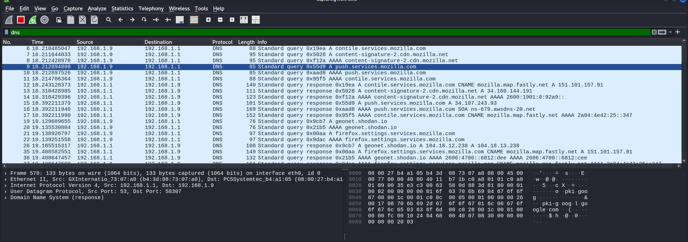
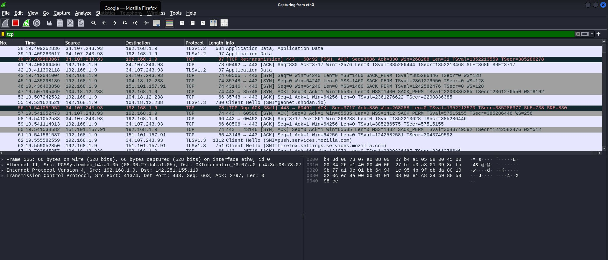
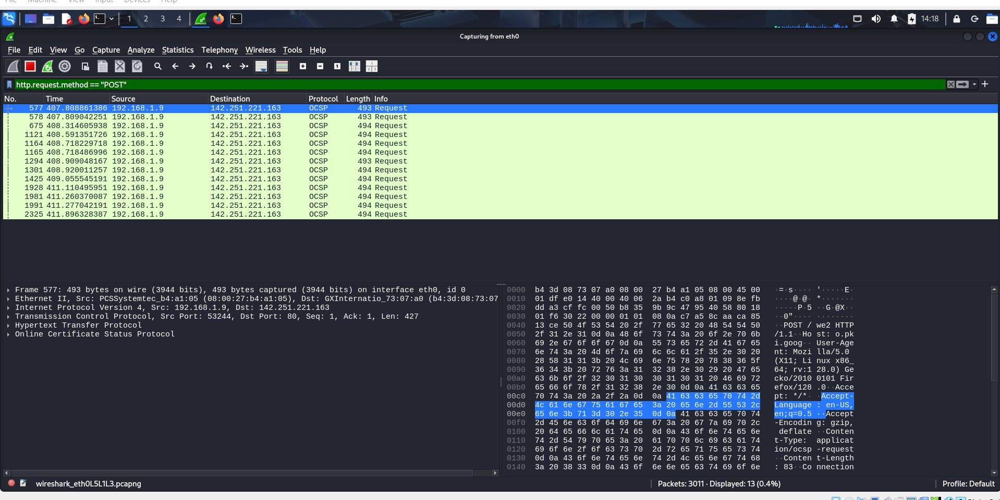

# 🔍 Wireshark Network Analysis Lab — Day 12
**Author:** Nivedhitha K.S  
**Date:** March 2026  
**Tool:** Wireshark on Kali Linux  
**Target:** Live network traffic + DVWA login capture  
**Category:** Network Security | Packet Analysis | CEH Module 8

---

## 📋 Overview

This report documents hands-on network traffic analysis using Wireshark. Four different capture filters were applied to analyse real network traffic, and a DVWA login was captured in plain text — demonstrating exactly why HTTP is dangerous.

---

## 🛠️ Lab Setup

| Component | Details |
|-----------|---------|
| Tool | Wireshark (Kali Linux) |
| Capture Interface | eth0 (external) + lo (loopback) |
| Target | Live network traffic + DVWA on localhost |
| Filters Used | http, dns, tcp, http.request.method=="POST" |

---

## 🧪 Lab 1 — HTTP Traffic Filter

**Filter applied:** `http`



### What This Shows
- All HTTP traffic captured on the network
- OCSP (Online Certificate Status Protocol) requests visible
- Source IP `192.168.1.9` communicating with `142.251.221.163`
- Raw HTTP packet data visible in hex and ASCII at the bottom
- POST requests visible in the Info column

### Security Relevance
Any HTTP traffic (port 80) is **unencrypted**. Everything shown here — including any login credentials submitted over HTTP — is readable by anyone on the same network running Wireshark.

---

## 🧪 Lab 2 — DNS Query Filter

**Filter applied:** `dns`



### What This Shows
- All DNS lookups made by the machine
- Queries to: `contile.services.mozilla.com`, `push.services.mozilla.com`, `geonet.shodan.io`
- DNS responses with resolved IP addresses
- Both A records (IPv4) and AAAA records (IPv6) visible

### Security Relevance
DNS queries reveal **every website a user visits** — even if the connection itself is encrypted (HTTPS). An attacker monitoring DNS can build a complete profile of browsing activity. This is why DNS over HTTPS (DoH) was introduced.

**Notable finding:** `geonet.shodan.io` appearing in DNS queries — Shodan is a search engine for internet-connected devices. This tells the attacker the user may be doing security research.

---

## 🧪 Lab 3 — TCP Traffic Filter

**Filter applied:** `tcp`



### What This Shows
- All TCP connections in progress
- SYN packets (new connection attempts) to port 443 (HTTPS)
- TLS handshakes visible (TLSv1.2, TLSv1.3)
- TCP retransmissions — signs of network issues
- Connections to Google, Mozilla, and Shodan servers

### Key TCP Flags Visible
| Flag | Meaning |
|------|---------|
| `[SYN]` | New connection starting |
| `[SYN, ACK]` | Server accepting connection |
| `[ACK]` | Acknowledgement |
| `[PSH, ACK]` | Data being pushed |
| `[TCP Dup ACK]` | Retransmission detected |

### Security Relevance
TCP SYN packets are used in **SYN flood DoS attacks**. An attacker sending thousands of SYN packets without completing the handshake can exhaust server resources.

---

## 🧪 Lab 4 — POST Request Filter (Credential Capture)

**Filter applied:** `http.request.method == "POST"`



### What This Shows
- HTTP POST requests captured — these carry form data
- POST to `142.251.221.163` on port 80
- Full packet contents visible in hex dump
- `POST /we2 HTTP/1.1` visible in ASCII panel

### The Critical Finding — DVWA Login Captured

When the DVWA login was submitted over HTTP (port 42001 on loopback), the following was visible in plain text in the TCP stream:

```
POST /login.php HTTP/1.1
Host: 127.0.0.1:42001
...
username=admin&password=password&Login=Login&user_token=4b9b...
```

**Username and password were completely visible in plain text.**

### Why This is Dangerous in Real Life

Imagine this scenario:
1. You connect to a coffee shop WiFi
2. You log into a website that uses HTTP (no padlock)
3. Anyone else on that WiFi running Wireshark can see:
   - Your username
   - Your password
   - Everything you submit

This takes **less than 30 seconds** to capture.

---

## 📊 Filter Summary

| Filter | Purpose | What It Found |
|--------|---------|---------------|
| `http` | Show all HTTP traffic | OCSP requests, POST data |
| `dns` | Show DNS lookups | mozilla.com, shodan.io queries |
| `tcp` | Show all TCP connections | SYN/ACK handshakes, TLS traffic |
| `http.request.method == "POST"` | Find form submissions | Credential data in plain text |

---

## 🔑 Key Security Findings

### Finding 1 — Credentials Visible in HTTP (CRITICAL)
DVWA login credentials captured in plain text over HTTP.  
`username=admin&password=password` visible without any decryption.  
**Fix:** Always use HTTPS. Never submit passwords over HTTP.

### Finding 2 — DNS Leaks Browsing History (MEDIUM)
Even with HTTPS, DNS queries reveal every domain visited.  
Shodan.io lookup visible — reveals security research activity.  
**Fix:** Use DNS over HTTPS (DoH) or a VPN with DNS leak protection.

### Finding 3 — TCP Retransmissions Detected (LOW)
Multiple `[TCP Dup ACK]` and retransmission packets visible.  
Indicates network instability or potential packet loss.  
**Fix:** Network infrastructure review recommended.

---

## 🛡️ Wireshark Filters Cheat Sheet

```bash
# Basic protocol filters
http                              # All HTTP traffic
dns                               # All DNS queries
tcp                               # All TCP traffic
udp                               # All UDP traffic

# Find credentials
http.request.method == "POST"     # Form submissions
http contains "password"          # Packets with password keyword

# Filter by IP
ip.addr == 192.168.1.1           # Traffic to/from IP
ip.src == 192.168.1.9            # Traffic FROM this IP
ip.dst == 192.168.1.1            # Traffic TO this IP

# Filter by port
tcp.port == 80                    # HTTP traffic
tcp.port == 443                   # HTTPS traffic
tcp.port == 22                    # SSH traffic

# Find specific attacks
tcp.flags.syn == 1                # SYN packets (DoS detection)
arp                               # ARP traffic (ARP poisoning)
```

---

## 📚 Key Learnings

1. **HTTP is completely transparent** — passwords, session tokens, and all data visible
2. **DNS leaks browsing history** — even HTTPS doesn't hide which sites you visit
3. **Wireshark filters are essential** — raw captures have thousands of packets; filters find the signal
4. **TCP flags tell a story** — SYN, ACK, PSH reveal exactly what's happening in a connection
5. **Loopback traffic needs separate capture** — localhost traffic doesn't appear on eth0

---

## 🔗 References

- [Wireshark Documentation](https://www.wireshark.org/docs/)
- [Wireshark Display Filters](https://wiki.wireshark.org/DisplayFilters)
- [CEH Module 8 — Sniffing](https://www.eccouncil.org/programs/certified-ethical-hacker-ceh/)
- [OWASP — Transport Layer Protection](https://owasp.org/www-project-top-ten/)

---

*Part of my 60-day cybersecurity learning journey — Day 12.*  
*GitHub: [NivedhithaKS-SEC](https://github.com/NivedhithaKS-SEC/cybersec-journey)*  
*TryHackMe: [NivedhithaKS](https://tryhackme.com/p/NivedhithaKS)*
