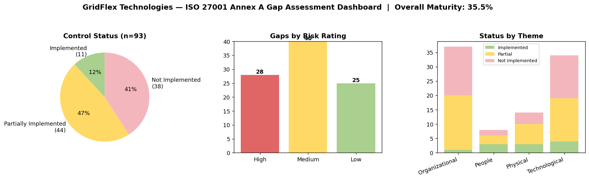

# ISO/IEC 27001:2022 — Annex A Gap Assessment (GridFlex Technologies)

## Overview
This project is a full **Annex A gap assessment** conducted against all **93 controls** of ISO/IEC 27001:2022, performed for a fictional company — **GridFlex Technologies**, a ~120-employee SaaS company providing a customizable AI app builder (CRM, Help Desk, Ticketing, Operations), hosted on AWS and handling customer business data.

It was built as a self-directed exercise to apply ISO 27001 concepts practically — going through each of the four Annex A themes (Organizational, People, Physical, Technological), assessing current implementation status, identifying gaps, rating risk, and producing a prioritized remediation roadmap.

## Methodology
1. **Defined scope** — organization profile, infrastructure, and data types in scope.
2. **Assessed each of the 93 controls** against a realistic "current state" for a company at this stage of maturity, and rated status as:
   - 🟩 Implemented
   - 🟨 Partially Implemented
   - 🟥 Not Implemented
3. **Identified the gap** between current state and the control's intent.
4. **Risk-rated each gap** (High / Medium / Low) based on likelihood and business impact.
5. **Recommended remediation actions**, assigned an owner role, and a target timeline.
6. **Built a remediation roadmap** sequencing fixes into 0-30 / 30-90 / 90-180 day phases.

## Dashboard Summary

| Metric | Result |
|---|---|
| Overall Maturity Score | **35.5%** |
| Controls Implemented | 11 / 93 |
| Partially Implemented | 44 / 93 |
| Not Implemented | 38 / 93 |
| High Risk Gaps | 28 |

## Key Findings (Top High-Risk Gaps)

| Control | Area | Gap | Recommendation |
|---|---|---|---|
| A.8.9 | Configuration Management | No secure configuration baselines (CIS benchmarks) or IaC | Define CIS AWS baselines; adopt Terraform for consistency |
| A.8.11 | Data Masking | Real customer data used in dev/staging | Implement masking/synthetic data for non-prod environments |
| A.8.25 / A.8.28 / A.8.29 | Secure SDLC | No security gates in development lifecycle (secure coding, SAST/DAST, security testing) | Embed OWASP-based secure coding standards and automated security testing in CI/CD |
| A.5.18 | Access Rights | No formal Joiner-Mover-Leaver (JML) process | Implement JML with 24-hour SLA for access revocation |
| A.6.3 | Security Awareness | No ongoing training program | Annual awareness training + phishing simulations |
| A.5.12 | Data Classification | No classification scheme | Define 3-4 tier classification (Public/Internal/Confidential/Restricted) |

## What's in This Repo

- `GridFlex_ISO27001_Annex_A_Gap_Assessment.xlsx` — full workbook with 4 sheets:
  - **Overview** — scope, methodology, legends
  - **Gap Assessment** — all 93 controls (status, current state, gap, risk, remediation, owner, timeline)
  - **Dashboard** — auto-calculated maturity score and breakdowns by status/risk/theme
  - **Remediation Roadmap** — phased 0-30/30-90/90-180 day action plan
- `dashboard_summary.png` — visual summary

## What I Learned
The biggest takeaway from this exercise wasn't about tools — it was realizing that most "security gaps" in a growing company aren't a complete absence of security, but **informal practices that exist without documentation, ownership, or periodic review**. Going through all 93 controls also helped me understand how the four Annex A themes interrelate — for example, how access control (A.5.15), identity management (A.5.16), and privileged access (A.8.2) all connect into one overall access governance story, and how a single underlying issue (e.g., no formal JML process) creates gaps across multiple controls.

This project also gave me a much clearer picture of how a real ISO 27001 implementation would differ — particularly around the role of a **Statement of Applicability (SoA)** and a formal **risk assessment** driving which controls apply, rather than assuming all 93 are relevant by default.

## Disclaimer
GridFlex Technologies is a fictional company created for this exercise. This project is intended to demonstrate methodology and practical understanding of ISO/IEC 27001:2022 Annex A, not an actual audit of any real organization.

---
**Author:** Nivedhitha K.S. | [LinkedIn](https://linkedin.com/in/nivedhitha-k-s) | [GitHub](https://github.com/NivedhithaKS-SEC)
